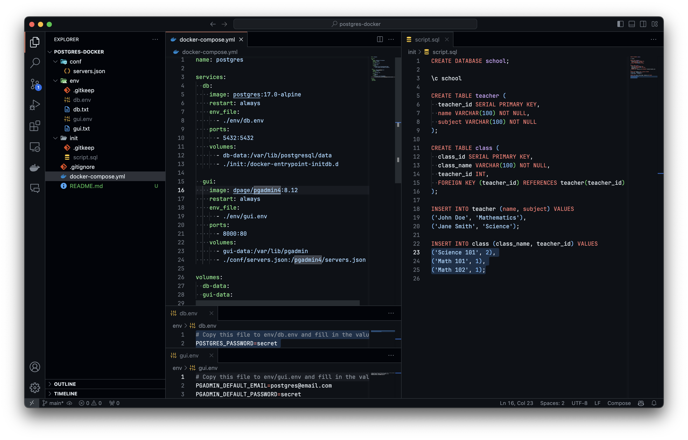
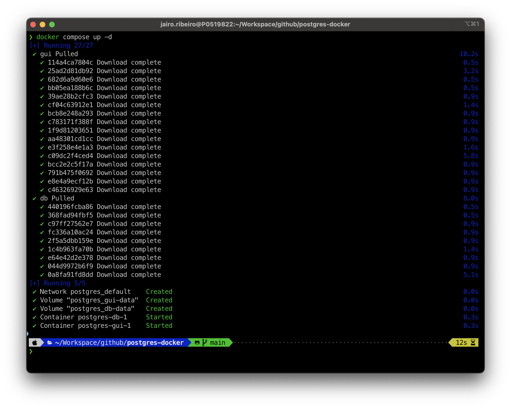
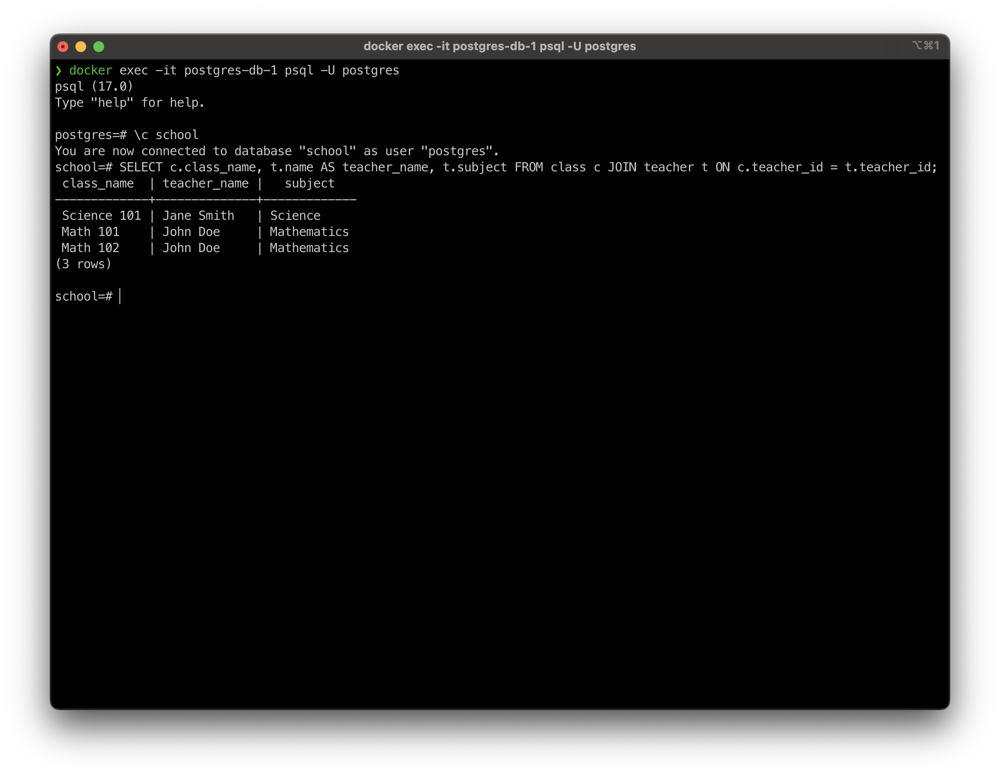
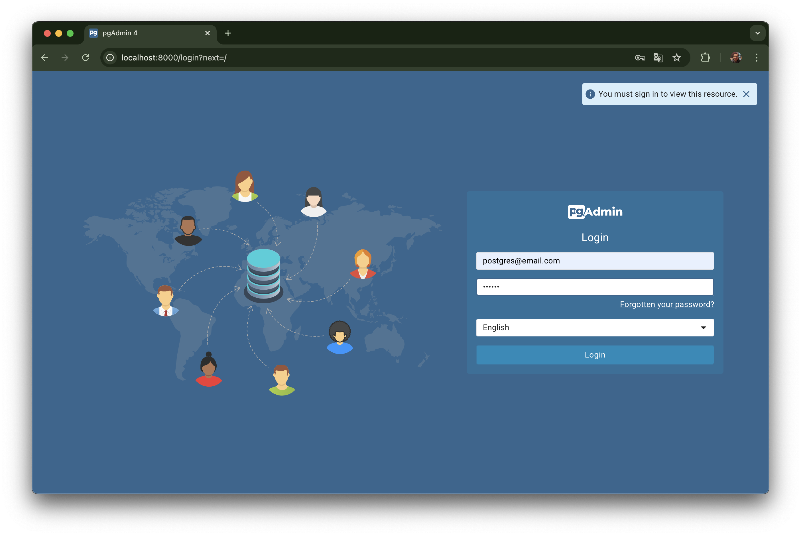
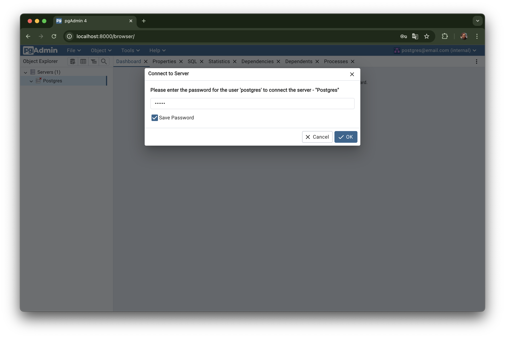
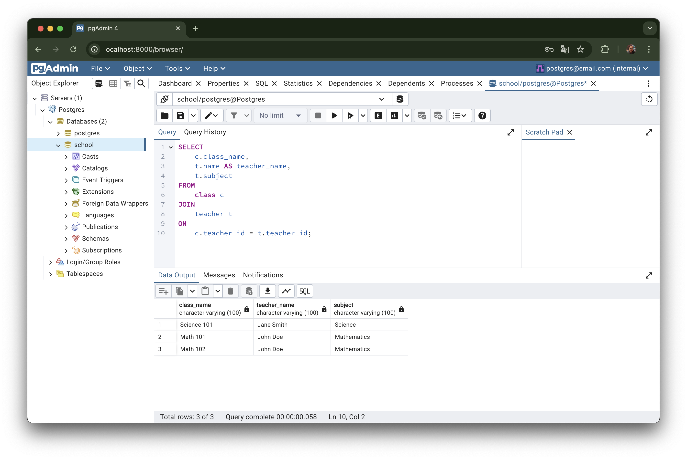

# Postgres-Docker

This project sets up a PostgreSQL database along with pgAdmin using Docker containers, providing a simple and reproducible environment for database management.

## Project Structure

- **docker-compose.yml**: Defines the services for PostgreSQL (`db`) and pgAdmin (`gui`) containers.
- **.env files**: Stores environment variables, such as database passwords and pgAdmin credentials.
- **init folder**: Contains SQL scripts for initializing the database upon container creation.
- **servers.json**: Configures pgAdmin with a default PostgreSQL server on first launch.

## Prerequisites

- Docker
- Docker Compose

## Setup

1. **Clone the repository**:

   ```bash
   git clone https://github.com/jairoduarteribeiro/postgres-docker.git
   cd postgres-docker
   ```

  

2. **Configure environment variables**:
   - Copy the `.env` example files and adjust the values.

   ```bash
   cp env/db.env.example env/db.env
   cp env/gui.env.example env/gui.env
   ```

   - In `env/db.env`, set your PostgreSQL password:
     ```bash
     POSTGRES_PASSWORD=yourpassword
     ```

   - In `env/gui.env`, configure pgAdmin credentials:
     ```bash
     PGADMIN_DEFAULT_EMAIL=your-email@example.com
     PGADMIN_DEFAULT_PASSWORD=yourpassword
     ```

3. **Initialize SQL scripts**:
   - Place any SQL scripts for initializing the database inside the `init/` folder.

4. **Configure pgAdmin server**:
   - The `conf/servers.json` file automatically adds the PostgreSQL server to pgAdmin when the container starts.

   ```json
   {
     "Servers": {
       "1": {
         "Name": "Postgres",
         "Group": "Servers",
         "Host": "db",
         "Port": 5432,
         "Username": "postgres",
         "MaintenanceDB": "postgres",
         "SSLMode": "prefer"
       }
     }
   }
   ```

## Usage

### Start the containers

To bring up both the PostgreSQL and pgAdmin containers, run:

```bash
docker compose up -d
```

This will start the services and display the following output:



### Accessing PostgreSQL via Command Line

You can access the PostgreSQL database using the following command:

```bash
docker exec -it postgres-db-1 psql -U postgres
```

Example of querying the database:

```sql
\c school
SELECT c.class_name, t.name AS teacher_name, t.subject
FROM class c
JOIN teacher t ON c.teacher_id = t.teacher_id;
```



### Accessing pgAdmin

Open your browser and go to `http://localhost:8000` to access pgAdmin. Log in using the credentials you set in the `gui.env` file.



Once logged in, you'll see the preconfigured PostgreSQL server in pgAdmin.



### Using pgAdmin

Once pgAdmin is set up, you can use it to create other databases, run the query tool, and manage your PostgreSQL server.



### Stopping the containers

To stop the containers, run:

```bash
docker compose down
```

This will stop and remove the containers, but the database data will persist in the volumes.

## Volumes

The data for PostgreSQL and pgAdmin is stored in Docker volumes, allowing you to preserve your data between container runs.

- **db-data**: Stores PostgreSQL database data.
- **gui-data**: Stores pgAdmin settings and data.
